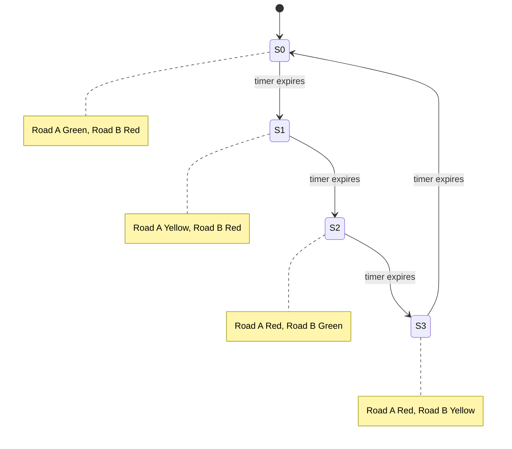
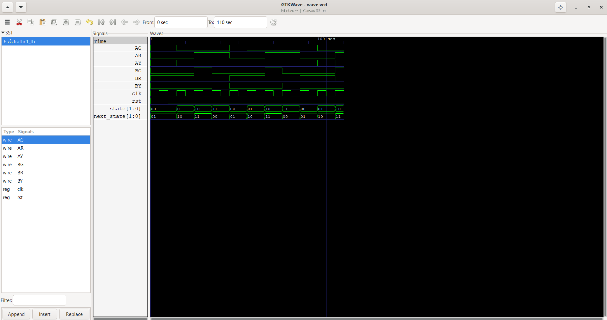

# Traffic Light Controller FSM

A Moore finite state machine implemented in Verilog that controls traffic lights for a two-road intersection, cycling correctly through Green → Yellow → Red transitions for each road.

---

## Why This Project

FSMs are the backbone of almost every digital controller — UART, vending machines, CPU control units. This project builds the discipline of state encoding, next-state logic, and output logic separately, which directly carried over into the control unit design in my [8-bit CPU project](https://github.com/vivekrai97709/CONTROL_UNIT_OF_UC).

---

## FSM Type

Moore State Machine (outputs depend only on current state, not inputs) — chosen for glitch-free outputs, important for real traffic light hardware where flickering signals would be unsafe.

---

## States

| State | Road A | Road B |
|---|---|---|
| S0 | Green | Red |
| S1 | Yellow | Red |
| S2 | Red | Green |
| S3 | Red | Yellow |

### State Diagram



---

## Inputs / Outputs

**Inputs**

| Signal | Width | Description |
|---|---|---|
| `clk` | 1 | System clock |
| `rst` | 1 | Active-high reset |

**Outputs**

| Signal | Description |
|---|---|
| `AG`, `AY`, `AR` | Road A Green / Yellow / Red |
| `BG`, `BY`, `BR` | Road B Green / Yellow / Red |

---

## FSM Architecture

1. **State Register** — holds current state, updates on clock edge
2. **Next-State Logic** — combinational, determines transition
3. **Output Logic** — combinational, maps state to light outputs (Moore-style)

---

## Simulation Waveforms

Verified in GTKWave — confirms the FSM cycles through all four states in order and returns to S0 after a full sequence, with no overlapping or skipped states.



## Repository Structure

├── rtl/         # FSM design (Verilog)

├── tb/          # Testbench

├── waveform/    # GTKWave screenshots

├── traffic_sim  # Simulation binary/output

├── wave.vcd     # Raw waveform dump

└── README.md

---

## How to Run

```bash
iverilog -o traffic_sim rtl/traffic1.v tb/traffic1_tb.v
vvp traffic_sim
gtkwave wave.vcd
```

---

## Applications

Traffic management systems, protocol controllers, UART controllers, CPU control units, embedded system sequencers — any system that needs a fixed, predictable sequence of states.

---

## What I'd Improve Next

- Add a pedestrian-crossing state with a push-button input (makes it a Mealy/Moore hybrid)
- Parameterize timing per state instead of a fixed cycle
- Extend to a 4-way intersection (currently 2 roads)

---

## Author

**Vivek Rai** — Electronics & Telecommunication Engineering, TSEC Mumbai
Interests: Digital Design · FPGA · Computer Architecture · VLSI
